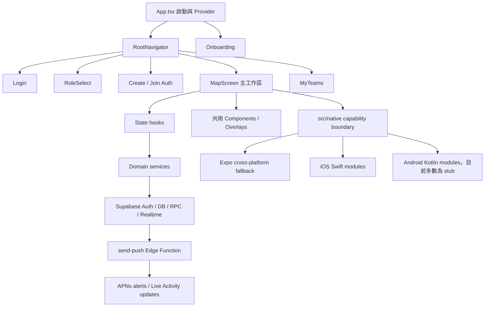
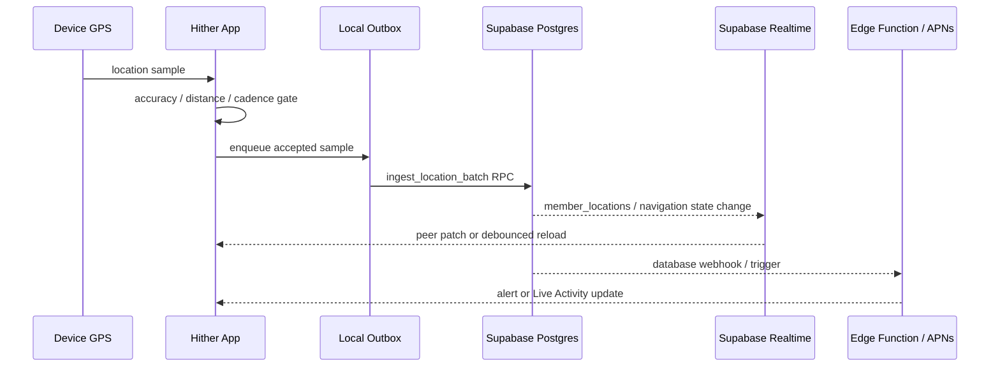

# Hither 現有 App 功能與架構

> 盤點日期：2026-07-20  
> 程式碼基準：`ee91cba`（2026-07-19）及目前工作區  
> 用途：描述目前程式碼已存在的產品能力、執行流程、模組邊界與平台完成度。歷史 PRD／設計稿不等同現況，本文件以實際程式碼為準。

## 1. 產品定位

Hither 是旅遊隊伍即時集合與協同行程 App。核心模型是：

- 一個使用者可建立或加入多個隊伍。
- 隊伍有 leader 與 follower。
- 隊伍可安排跨日集合點／行程順序。
- 成員分享位置，在地圖查看彼此、集合點、距離、ETA 與抵達狀態。
- Leader 可啟動全隊導航 session、管理集合點、集合時間、抵達與掉隊提醒。
- 成員可暫時離隊、組成小隊、傳送快捷指令。
- iOS 可使用 Live Activity／Dynamic Island 持續顯示導航進度。

## 2. 技術基線

| 層級 | 技術 |
|---|---|
| App framework | Expo SDK 56、React Native 0.85.3、React 19.2.3、TypeScript 6.0.3 |
| Navigation | React Navigation native stack |
| 動畫／手勢 | Reanimated 4、Gesture Handler |
| 地圖 | `react-native-maps`；iOS MapKit、Android Google Maps |
| 定位 | `expo-location`、`expo-task-manager`，另有可選 Expo native module |
| Backend | Supabase Auth、Postgres、Realtime、Storage、Edge Functions |
| 本機狀態 | React Context、hooks、AsyncStorage、SecureStore、SQLite |
| 推播 | `expo-notifications` + APNs native／Edge Function |
| iOS 系統能力 | MapKit、ActivityKit、WidgetKit、MetricKit／native metrics |
| 更新 | Expo Updates / EAS Update |
| 測試 | Jest、Testing Library、TypeScript typecheck、Expo lint |

App 採 Expo New Architecture，`app.json` 設定 `newArchEnabled: true`。

## 3. 高階架構



## 4. 啟動與導覽流程

### App 啟動

`App.tsx` 的責任：

- 安裝 global error logger。
- 標記 native／JS launch phases。
- 載入 Fredoka 500／600 字型。
- 初始化 `PreferencesProvider` 與 `SessionProvider`。
- 恢復 Supabase session。
- 讀取本機 Onboarding completion flag。
- 在 session、Onboarding、字型都完成前顯示品牌 splash。
- 設定全域 Dynamic Type 上限與 Hither text role scaling。
- 註冊 push、群組通知、小隊邀請監聽。
- 依使用者同意啟用／停用 diagnostics、performance、MetricKit payload 與 batch uploader。

### Root routes

| Route | 功能 |
|---|---|
| `Login` | guest、email、Google、Apple 登入入口 |
| `RoleSelect` | 選擇建立隊伍、加入隊伍或查看既有隊伍 |
| `Auth` | leader 建立隊伍／follower 輸入代碼加入 |
| `Map` | 地圖與主要產品功能 |
| `MyTeams` | 列出、進入、離開或清空已加入隊伍 |

已恢復 session 的使用者啟動時略過 Login，先到 RoleSelect。

## 5. 現有功能清單

### 5.1 Onboarding

- 首次啟動以本機 flag gate 導覽。
- 角色分支：leader、follower、browser／旅伴探索。
- 主題選擇：night、day、dusk、forest。
- Leader 分支收集旅行目的、天數、出發日。
- Follower 分支以情境問題產生 mascot／旅伴型態。
- Browser 分支收集旅遊動機、同行者與想要的能力。
- 權限步驟處理定位／通知需求。
- 完成後同步到本機；登入後再補同步至 `profiles.onboarding`。
- 可從設定重設旅行偏好，重新顯示 Onboarding。

### 5.2 帳號與登入

- Supabase anonymous／guest session。
- email 註冊、登入與匿名帳號升級。
- Google OAuth。
- iOS native Sign in with Apple。
- 登出時停止背景導航並清除 Live Activities。
- Profile 儲存 nickname、emoji avatar、avatar color、Pro metadata、preferences。
- Account sheet 顯示帳號資訊與升級能力。
- 匿名帳號刪除 RPC 已存在。

### 5.3 隊伍

- Leader 建立隊伍與 6 碼 invite code。
- Follower 使用代碼加入。
- 同一帳號可加入多隊。
- MyTeams 顯示隊名、人數、代碼與成員 avatar。
- 進入指定隊伍、離開單一隊伍、清空所有隊伍。
- 離開／登出時清除相關背景旅程與 Live Activity 狀態。
- 空隊伍／空小隊有 server cleanup function。

### 5.4 地圖主畫面

- 顯示自己的系統定位藍點。
- 顯示所有隊員的名稱、emoji／首字母 marker。
- Leader marker 有差異化外框。
- 顯示集合點、其他行程點與待確認搜尋點。
- 顯示本人到集合點的 route polyline。
- marker 位置在 GPS fix 間做顯示插值，不外推不存在的位置。
- camera 能力：recenter、centerOn、fitToMembers、focusOblique、fitRoute。
- camera 會把 bottom sheet 與頂部 carousel 遮擋納入可視區置中計算。
- day palette 使用 light map，其他 palette 使用 dark map。
- Android／iOS native map 共用同一 `GroupMap`；web 有獨立 fallback component。

### 5.5 Bottom sheet 與主要 pane

MapScreen 使用三段 detent bottom sheet，內含三個主要 pane：

- `members`：主隊／小隊成員與狀態。
- `route`：行程點、導航與抵達管理。
- `tools`：快捷指令、設定與其他工具。

MapScreen 另外管理下列 overlay：

- route reorder；
- settings；
- diagnostics；
- invite；
- profile；
- account；
- my status；
- arrival management；
- arrival marking；
- commands；
- history；
- feedback；
- custom quick command。

### 5.6 集合點與跨日行程

- 地點文字搜尋與 viewport bias。
- 選取地點後顯示 marker 與加入／取消確認卡。
- Leader 新增、刪除、拖曳排序集合點。
- 行程可設定天數與出發日期。
- 每個 destination 有 day、order、meet time、meet warning threshold。
- 過去 trip day 的點從 active list 移至歷史投影。
- 啟動導航時可把選取點提升為當日第一個未完成 stop。
- KML 檔案匯入，多點解析與免費方案上限。
- 小隊可有自己的 itinerary；離開主隊後不會看到主隊集合卡。

### 5.7 搜尋、路線與 ETA

- `src/native/maps.ts` 是 UI 唯一使用的地圖搜尋／路線 boundary。
- iOS native module：
  - `MKLocalSearch.naturalLanguageQuery` 搜尋地點；
  - `MKDirections` 取得 walk／drive／transit 路線、距離、時間、polyline。
- JS 搜尋 fallback：Photon 優先，Nominatim 次之，結果依 viewport 中心的 haversine 距離重排。
- 本人有 native route 時使用真實 route distance／ETA。
- member list 預設使用 haversine 距離與固定速度，不對每個成員呼叫 native route，控制 radio、CPU 與 API 成本。
- native directions 不可用時：
  - walk 1.4 m/s；
  - drive 10 m/s；
  - transit 6.5 m/s。
- 目前外部導航 helper 是 Apple Maps URL，Android 尚未有平台對應。

### 5.8 全隊導航 session

- Leader 啟動、取消、完成 server-authoritative navigation session。
- `request_id` 防止重複啟動；`version` 支援 optimistic concurrency。
- 成員狀態包括：pending、activity_started、tracking_active、permission_denied、location_disabled、force-quit suspected、offline、push unavailable、sharing disabled、arriving、arrived、missed、cancelled。
- Supabase Realtime 同步 session 與 member state。
- Leader 與 follower 使用同一 destination；follower 可有 local route plan。
- navigation session 有 expiry、arrival radius 與 destination snapshot。
- route／位置更新有 quantization、距離與時間 gate，避免 GPS jitter 反覆重算。

### 5.9 定位、背景執行與抵達

- 前景定位使用 `expo-location`；可選 native module，不可用時 fallback。
- 位置資料包含座標、accuracy、timestamp。
- App 前景時訂閱 Supabase Realtime；背景時移除 channel，減少 radio 使用。
- peer location change 先 patch 記憶體，其他資料變更 debounce reload。
- 背景定位使用 Task Manager，分為：
  - all-day 省電 presence；
  - journey；
  - team navigation；
  - navigation max／manual high accuracy。
- 根據移動／靜止 cadence 調整 upload heartbeat。
- location outbox 先落本機，再 batch ingest；有 retry／discard 與 diagnostics。
- location sharing 關閉時清空 outbox，server 也以 `member_privacy_settings` 強制驗證。
- 抵達 reducer 使用距離、accuracy、arrival radius 與狀態機避免單次飄點誤判。
- 抵達可自動或手動標記；Leader 可代成員標記並選擇抵達時間。
- 完成 stop 後寫入 history，並推進下一個 itinerary stop。

### 5.10 集合時間與掉隊提醒

- Leader 可設定每個 destination 的集合日期／時間。
- countdown 在 3、5、10 分鐘門檻轉紅；門檻可設定並同步。
- server 有 meet-time set、warning、due push trigger。
- 掉隊距離可設定；免費方案固定上限 500 m。
- Leader 可查看 straggler、回報掉隊與請求群組位置刷新。
- 掉隊判定排除不適用的 solo／scope 成員並有 hysteresis 邏輯。

### 5.11 小隊、Solo 與成員狀態

- 使用者可設 follow／solo／away 類型狀態。
- Solo 是全域使用者狀態，不綁單一 member card。
- 小隊支援邀請、接受、拒絕與待處理提示。
- 小隊成員使用 subgroup-scoped itinerary、通知與歷史投影。
- 小隊可 merge 回上一層；empty subgroup 會被清除。
- Leader 可查看全部 itinerary，follower 只讀自己 scope。

### 5.12 快捷指令與通知

Leader 固定指令：

- 集合、尋找集合點、出發、休息、小心、往左、往右、停止、快一點。

Follower 固定請求：

- 想上廁所、需要休息、需要幫忙；另有 found something domain type。

自訂指令：

- 帳號可儲存 3 個 custom slots。
- Leader grid 使用 1 個 custom slot；follower grid 使用 3 個。
- 指令寫入 `commands`，由 Realtime／push 顯示。

通知偏好按類別儲存：

- add gathering；
- leader commands；
- follower requests；
- journey。

iOS production path 由 Postgres trigger 呼叫 Supabase Edge Function，再依 scope、solo 狀態、角色與通知偏好發 APNs。

### 5.13 iOS Live Activity

- 開始、更新、結束單一或全部 Live Activity。
- 支援 push token 與 push-to-start token。
- Live Activity session 會保存到 Supabase，供 APNs remote update。
- 本機背景 GPS 可離線更新距離與 progress。
- Dynamic Island 有 expanded、compact、minimal 版型。
- Lock Screen／Dynamic Island 顯示：集合點名稱、ETA、距離、進度、成員 avatar、抵達狀態、交通模式。
- App cold start、leave group、sign out 時會清掉 orphan activity。

Android `hither-live-activity` 目前只有 no-op stub。

### 5.14 歷史行程

- 抵達 waypoint 寫入 `visited_waypoints`。
- 依天分組與時間排序。
- member 看自己的紀錄；leader 可看 team projection。
- 過去日但未抵達的 destination 會合併成 synthetic missed／incomplete row。
- 免費方案保留／顯示 3 筆限制，Pro 移除限制。

### 5.15 設定

- 帳號、Pro、切換隊伍、建立／加入、登出。
- 語言：繁中、英文。
- 主題：night、day、dusk、forest。
- App 文字大小：0.8、0.9、1.0、1.1、1.2。
- location sharing、高精度、45° oblique locate。
- Live Activity 開關。
- 集合卡預設展開、長標題 marquee、marquee speed。
- 抵達半徑：30、50、100、300 m。
- notification preferences。
- straggler 設定。
- custom quick commands。
- diagnostics upload opt-in。
- 檢查與套用 Expo OTA update。
- feedback、diagnostics、版本與 update id。
- Leader 結束隊伍／member 離開隊伍。
- 重設偏好與 Onboarding。

### 5.16 Feedback、Diagnostics 與效能

- App event／error queue 與 global error logger。
- Feedback sheet 可附加開啟前的畫面截圖與 context tag。
- diagnostics 預設關閉，使用者同意後才收集／上傳。
- SQLite／本機 queue 保存 diagnostics、performance、metric payload。
- batch scheduler 以筆數、最長等待時間與 backoff 控制上傳。
- Supabase API 有 instrumentation wrapper。
- JS FPS、render tracing、interaction、navigation energy monitor。
- iOS native metrics／MetricKit payload；Android native metrics 目前空實作。
- DB 有 performance events 與 daily rollups。

### 5.17 Freemium／Pro

目前 client-side 免費限制：

| 項目 | Free |
|---|---:|
| 隊伍成員 | 4 |
| 匿名成員 | 2 |
| 每份 itinerary destinations | 5 |
| KML 匯入點 | 5 |
| straggler threshold | 500 m |
| 歷史項目 | 3 |

`profiles.pro`、plan／purchase metadata、promo code 與 paywall UI 已存在；但 `purchasePro()` 與 `restorePurchases()` 仍固定回傳 `unavailable`，所以商店實際購買尚未完成。

## 6. 前端模組邊界

### Screens

- `src/screens/LoginScreen.tsx`
- `src/screens/RoleSelectScreen.tsx`
- `src/screens/AuthScreen.tsx`
- `src/screens/MapScreen.tsx`
- `src/screens/MyTeamsScreen.tsx`

### MapScreen 子模組

- `hooks/useDeviceLocation.ts`：前景位置 owner。
- `hooks/useCarouselSelection.ts`：集合卡與 map 選取同步。
- `hooks/useGatherCardExpansion.ts`：集合卡展開狀態。
- `hooks/useJourneyNavigation.ts`：leader／follower navigation commands。
- `hooks/useMapKitRoutes.ts`：route cache、gate、native directions。
- `components/SettingsOverlay.tsx`
- `components/DiagnosticsOverlay.tsx`
- `components/ProfileOverlay.tsx`
- `components/SubgroupSection.tsx`
- `components/Segmented.tsx`

### State hooks／controllers

| 模組 | 職責 |
|---|---|
| `SessionContext` | session、profile、membership、Pro、custom commands |
| `PreferencesContext` | 本機偏好、theme、language、location/privacy UI settings |
| `useAuthFlow` | anonymous、email、Google、Apple auth |
| `useGroupState` | group snapshot、Realtime、peer location patches |
| `useNavigationSession` | navigation session mutation／subscription |
| `useLiveActivity` | ActivityKit lifecycle 與 DB session |
| `usePushRegistration` | device push token registration |
| `useGroupNotifications` | foreground／local group notification |
| `useStragglerAlerts` | straggler detection／alerts |
| `useSubgroupInvites` | invite state、notification、accept／decline |
| `backgroundJourney*` | background task、permission、power mode、arrival |
| `locationOutbox` | offline queue 與 batch upload |
| `diagnostics`／`performance` | opt-in telemetry queues |

### UI components

- BottomSheet、OverlaySheet。
- GroupMap、DestinationSearch、DestinationReorderList。
- AccountSheet、FeedbackSheet、KmlImportSheet、PaywallSheet。
- NotificationPreferencesCard、QuickCommandsCard、CustomQuickCommandSheet。
- GlassView、HitherText、PrefSlider、OverflowMarquee、MeetCountdown、CrookIcon。

## 7. Data／API layer

`src/api/client.ts` 是相容用 barrel；新程式預期直接引用 domain service。

| Service | 主要責任 |
|---|---|
| `GroupService` | group create/join/state、journey、straggler、solo、split/merge、my teams |
| `DestinationService` | add/delete/complete/reorder destination、meet time |
| `GatheringWorkflowService` | gather requests、approve/reject、destination arrivals |
| `NavigationService` | navigation session、member ack、privacy、Realtime |
| `LocationService` | location upload、location refresh request |
| `NotificationService` | push token、commands、notification preferences |
| `SubgroupService` | invite／accept／decline／fetch invites |
| `ProfileService` | nickname、profile、Onboarding、Pro、promo |
| `WaypointService` | history write/read/delete |
| `LiveActivityService` | Live Activity session persistence |
| `DiagnosticService` | diagnostic／metric upload |
| `PerformanceService` | performance batch upload |

資料庫 row 採 snake_case；UI domain type 採 camelCase，mapping 集中在 services。

## 8. Supabase 資料模型

### 核心產品 tables

- `profiles`
- `groups`
- `memberships`
- `itinerary_items`
- `member_locations`
- `subgroups`
- `subgroup_invites`
- `commands`
- `notification_preferences`
- `push_tokens`
- `visited_waypoints`
- `gather_point_requests`
- `destination_arrivals`
- `location_refresh_requests`
- `promo_codes`

### 導航／Live Activity／隱私

- `live_activity_sessions`
- `navigation_sessions`
- `navigation_member_states`
- `device_live_activity_tokens`
- `member_privacy_settings`
- `location_upload_events`

### 診斷與效能

- `activity_logs`
- `feedback_reports`
- `diagnostic_sessions`
- `diagnostic_events`
- `metric_payloads`
- `performance_events`
- `performance_daily_rollups`

### Server-authoritative RPC／triggers

重要 write 不完全依賴 client direct table write，包含：

- join group；
- set solo；
- split／merge subgroup；
- subgroup invite／accept／decline；
- redeem promo；
- start／cancel／complete navigation session；
- navigation member ack；
- batch location ingest；
- gathering request resolve；
- destination arrival；
- complete gathering stop；
- delete destination；
- request location refresh；
- anonymous account deletion；
- push triggers 與 empty group cleanup。

## 9. Realtime 與資料流



關鍵原則：

- 自己的位置由單一 foreground owner 或 background task 產生，避免重複 watch。
- peer location Realtime 優先 patch，不必每次完整 SELECT。
- App 進背景後移除 Realtime channel；背景 upload 由 Task Manager 負責。
- location sharing 是 client 與 server 雙重 gate。
- navigation session、arrival、complete stop 以 DB state／RPC 為權威。

## 10. Platform capability boundary

共用 JS 只透過 `src/native/*` 存取裝置能力：

| Boundary | Expo fallback | iOS module | Android module |
|---|---|---|---|
| `location.ts` | `expo-location` | 有 native seam | 回 `null`，讓 JS fallback |
| `maps.ts` | Photon／Nominatim；directions 無 fallback route | MKLocalSearch／MKDirections | 搜尋回空、directions 回空 |
| `notifications.ts` | Expo local notifications | APNs device token | token 回 `null` |
| `liveActivity.ts` | unsupported no-op | ActivityKit 完整實作 | `isSupported=false` |
| `liquidGlass.tsx` | Blur／View fallback | native glass when available | fallback surface |
| `metrics.ts` | JS queue | native metrics | 空 payload／sample |
| `purchases.ts` | unavailable | 未接 StoreKit | 未接 Play Billing |

## 11. iOS 完成度

### 已有實作

- React Native UI 與完整產品流程。
- Apple Maps 顯示、MKLocalSearch、MKDirections。
- foreground／background location 共用邏輯。
- ActivityKit、WidgetKit、Dynamic Island、push-to-start、remote update。
- APNs alerts、background location refresh push。
- iOS metrics module 與 performance pipeline。
- EAS Update 與 production APNs 設定文件。

### 尚未完成／仍需外部環境驗證

- StoreKit 實際購買與 restore。
- 所有 iOS native path 仍依簽章、entitlements、APNs credentials 與 EAS／Xcode build 環境。

## 12. Android 完成度

### 可直接共用的基礎

- 全部 React Native screens、components、theme、i18n。
- Auth／Supabase data services、RPC、Realtime。
- Expo Location／Task Manager 共用背景邏輯。
- AsyncStorage、SQLite、SecureStore、DocumentPicker、haptics、notifications 等 Expo APIs。
- `react-native-maps` 的 marker、polyline、camera API。

### 尚未完成

- `apps/mobile/android/` native project 尚未生成。
- Google Maps Android API key 與 config plugin 尚未設定。
- Android place search／directions native provider 尚未實作。
- Live Updates／ongoing navigation notification 尚未實作。
- FCM token 與 server fan-out 尚未實作。
- Android metrics native module 尚未實作。
- Google Play Billing 尚未實作。
- Android Apple OAuth fallback 尚未確認。
- APK 未建置、未安裝、未做 emulator／真機 journey test。

## 13. 測試與驗證資產

現有測試涵蓋：

- auth、anonymous sign-out、Apple auth UI contract；
- group state、Realtime location patch；
- navigation service、session、push contract、arrival；
- background journey、location policy、outbox、foreground owner；
- MapKit route、directions、camera、visible band；
- Live Activity contract；
- gathering workflow、arrival marking、history；
- KML、trip day、meet time、straggler；
- Dynamic Type、glass UI contract、theme；
- diagnostics、consent、batch scheduler、performance；
- production config、runtime alignment、native module version。

`docs/testflight/` 與 `docs/qa/` 另有 iOS acceptance／regression 文件。這些測試多數是 JS unit／contract tests，不能替代 Android emulator／真機對 native map、background service、notifications 與 OEM 行為的驗證。

## 14. 已知架構問題

- `MapScreen.tsx` 已超過 6,000 行，是主要功能匯集點；已有 hooks／components 拆分，但仍是高耦合核心。
- codebase-memory graph 的索引落後工作區，未包含 MyTeams、新 services、navigation、diagnostics 等近期檔案；本文件已以實際檔案補查。
- Android Maps stub 會短路 JS search fallback，是實際功能錯誤風險。
- server push 只支援 APNs，notification data model 雖可共用，transport 尚未抽象成 APNs＋FCM。
- Pro entitlement 目前主要由 client 判斷，註解明載 free limits 仍是 client-side enforcement。
- `purchases.ts` 是 placeholder，付費狀態與商店 receipt 尚無 authoritative verification。
- 舊文件部分有編碼損壞或已落後，不能當目前架構真相來源。

## 15. 重要目錄

```text
apps/mobile/
├─ App.tsx
├─ app.json
├─ src/
│  ├─ screens/            # routes 與 Map 主工作區
│  ├─ components/         # 共用 UI
│  ├─ state/              # contexts、hooks、background controllers
│  ├─ api/services/       # domain data services
│  ├─ native/             # platform capability boundary
│  ├─ onboarding/         # branching onboarding flow
│  ├─ utils/              # domain pure logic
│  ├─ types/              # UI domain types
│  ├─ i18n/               # zh / en strings
│  └─ __tests__/          # unit / contract tests
├─ modules/hither-*/      # Swift / Kotlin Expo modules
└─ targets/live-activity/ # iOS Widget Extension

supabase/
├─ migrations/            # schema、RLS、RPC、triggers
└─ functions/send-push/   # APNs alerts / ActivityKit updates

docs/                     # product、design、QA、handoff、調查文件
```

## 16. 未來方向、未來功能、未來風險

### 未來方向

- 保持 domain services 與 UI 共用，平台差異只存在 `src/native` 與 Expo modules。
- 將 MapScreen 剩餘獨立流程逐步移到既有 hooks／components，不新增抽象層級。
- 讓 push transport、map search／directions、live status surface 使用一致 capability contract。
- Android 驗收以同一 journey test matrix 與 iOS 資訊狀態對照。

### 未來功能候選

- Android Google Places／Routes。
- Android 16 Live Updates 與舊版 ongoing notification。
- FCM 與跨平台 remote notification。
- Google Play Billing／StoreKit receipt verification。
- Route Matrix 的多人 ETA。
- 外部 Google Maps navigation deep link 或 App 內 Navigation SDK。

### 未來風險

- 背景定位與推播是跨平台最大差異，且受 OS、OEM、權限、電池與商店政策共同影響。
- Android 地圖雖為 no-cost SKU，Routes／Places／Navigation 有不同計費單位與免費額度。
- Live Activity／Live Updates 系統 UI 無法像素級一致。
- 大型 MapScreen 使功能 parity 修正容易互相影響。
- client-side Pro 限制與 placeholder purchase 不足以作為正式付費安全邊界。
- 未重新索引知識圖譜前，架構查詢可能漏掉近期程式碼。

## 17. 相關文件

- [Android 版實作前調查報告](./android-preimplementation-research-2026-07-20.md)
- [MVP](./MVP.md)
- [Product](./PRODUCT.md)
- [Development status](./dev-status.md)
- [APNs Live Activity setup](./apns-live-activity-setup.md)
- [Team navigation test matrix](./testflight/team-navigation-test-matrix.md)
- [Navigation energy acceptance](./testflight/navigation-energy-acceptance.md)
